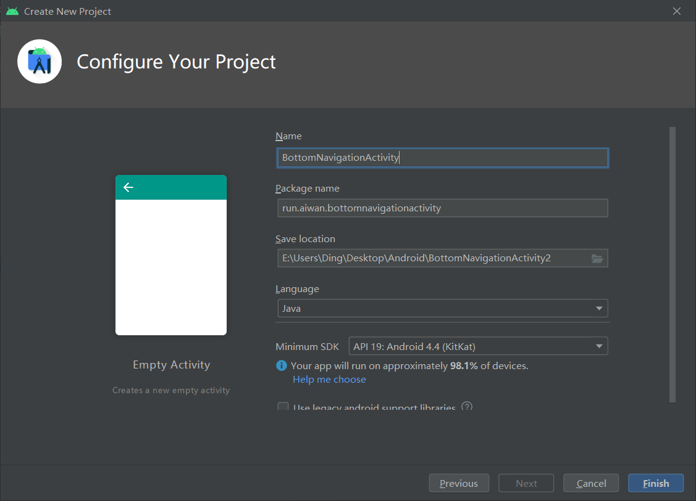
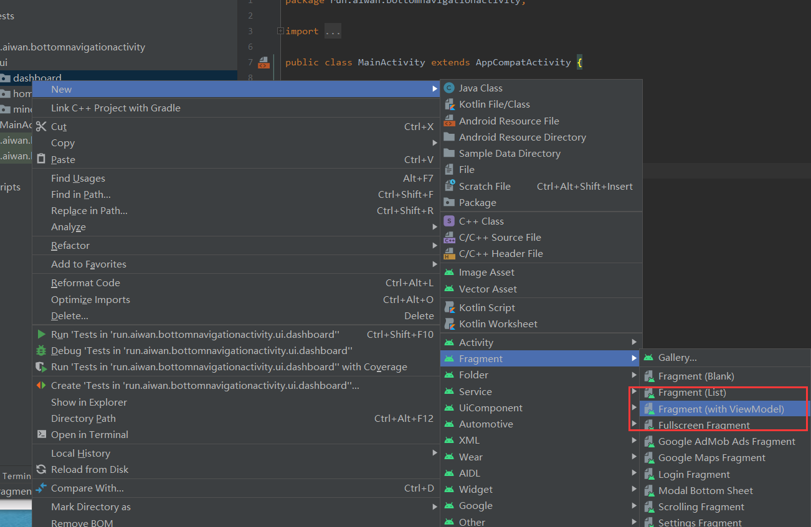
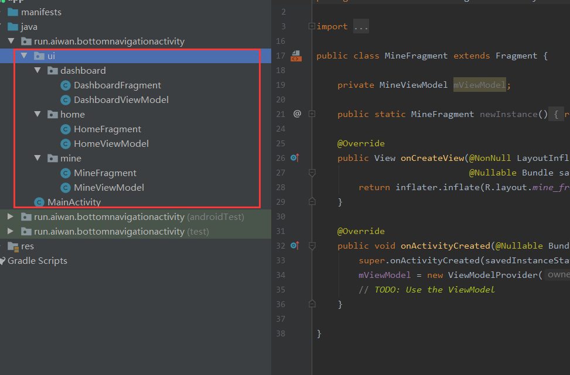
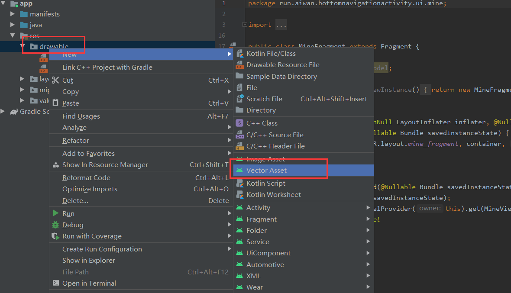
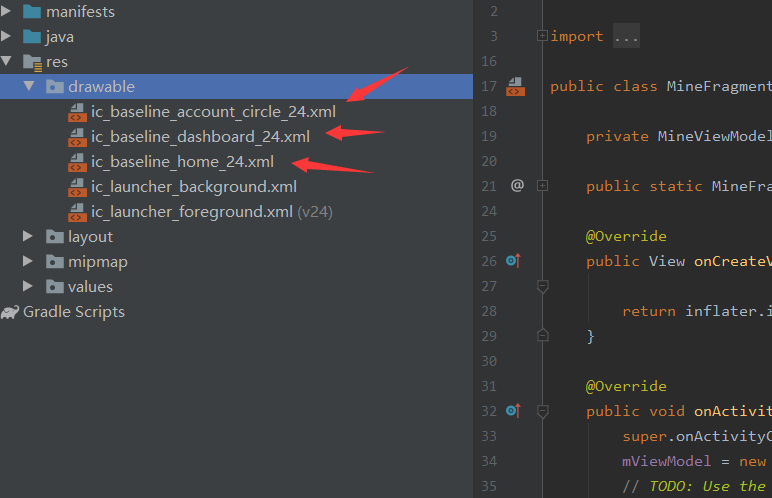
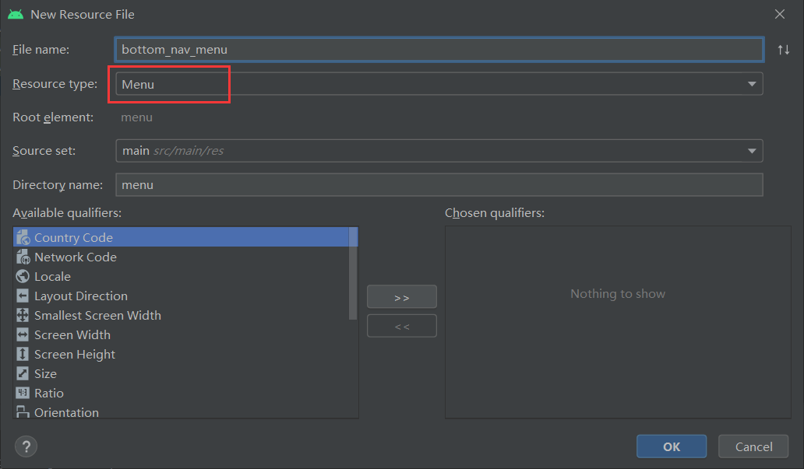
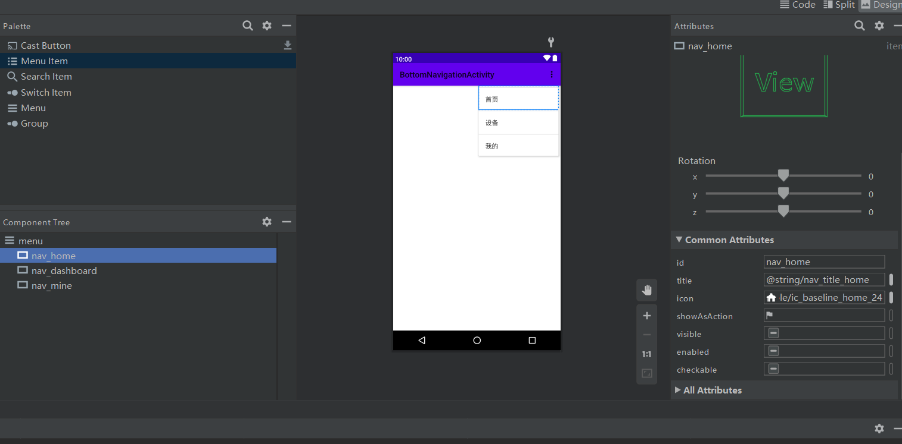
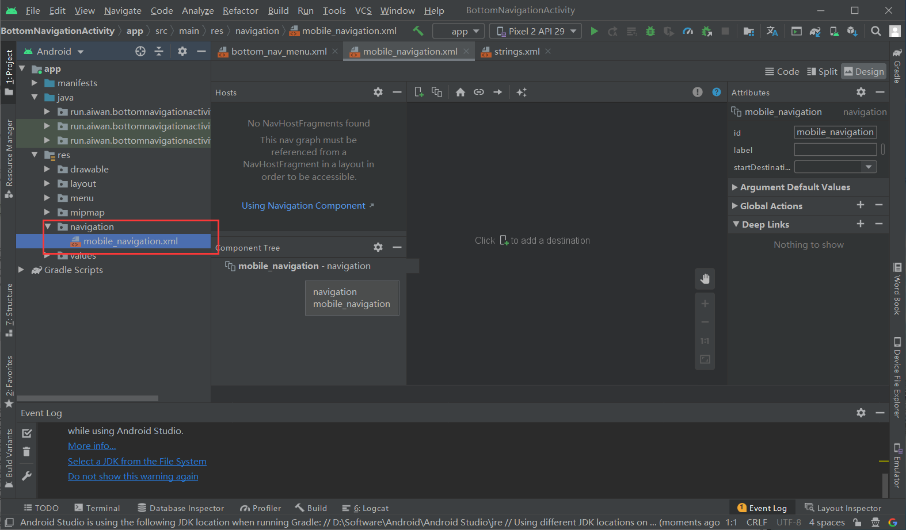
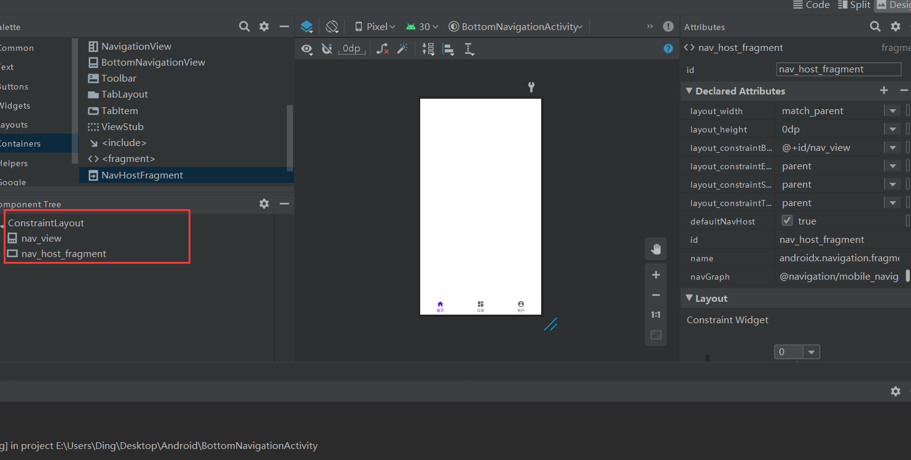

### 1.创建一个空项目



### 2.创建三个Fragment



结构



### 3.新建图标

Drawable



结构



### 4.创建菜单

Menu




添加内容



### 5.创建导航

Navigation




### 6. Activity Main

   

### 7. Main Activity

```
public class MainActivity extends AppCompatActivity {

    @Override
    protected void onCreate(Bundle savedInstanceState) {
        super.onCreate(savedInstanceState);
        setContentView(R.layout.activity_main);

        BottomNavigationView navView = findViewById(R.id.nav_view);
        // Passing each menu ID as a set of Ids because each
        // menu should be considered as top level destinations.
        AppBarConfiguration appBarConfiguration = new AppBarConfiguration.Builder(
                R.id.nav_home, R.id.nav_dashboard, R.id.nav_mine)
                .build();
        NavController navController = Navigation.findNavController(this, R.id.nav_host_fragment);
        NavigationUI.setupActionBarWithNavController(this, navController, appBarConfiguration);
        NavigationUI.setupWithNavController(navView, navController);
    }
}
```

### 8.注意

menu和navigation的id对应

