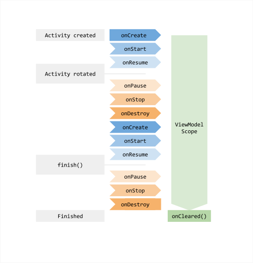

## ViewModel 的生命周期



## 其他

在build.gradle(:app)的 dependencies里添加
```
implementation 'androidx.lifecycle:lifecycle-extensions:2.2.0'
implementation "androidx.lifecycle:lifecycle-viewmodel:2.2.0"
```

然后写成
myViewModel = new ViewModelProvider(this).get(MyViewModel.class);


## 官方文档

https://developer.android.google.cn/topic/libraries/architecture/viewmodel
