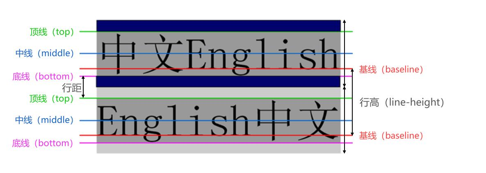

# 1. 常见属性
## 1.1 字体
- `font-family`
- `font-size`
- `font-style`: [normal || italic || oblique]
- `font-wight`
- `font-variant` 变体 将小写字母替换成大写字母高度不变 [normal || small-caps]
- `font`
- * `line-height`
- * `text-align`: [left || center || right || justify]
- `text-decoration` *装饰器* [overline || line-through || underline || none]
- `text-indent`
- `text-shadow`
- `text-transform`
- `text-overflow`
- `white-space`
- * `vertical-algin`
- `word-spacing`
- `letter-spacing`
- `word-break`
- * `color` 前景色
- * `opacity` 不透明度 0-1
### 1.1.1 line-height
> **一行**文字所占据的高度
> > 两行文本基线（baseline）的距离
> > > 基线 与小写字母 x 最底部对齐的线



### 1.1.2 font
> 缩写属性
```
font-style font-variant font-weight font-size/line-height font-family
```
# 2. 选择器 （selector）
- 属性选择器
- 后代选择器
- 兄弟选择器
- 选择器组
- 伪类选择器
- 伪元素
## 2.1 通用选择器（universal selector）
> 所有的元素都会被选中，不推荐使用

`*`
## 2.2 简单选择器
### 2.2.1 元素选择器（type selector）
```css
div { color: red }
```
### 2.2.2 类选择器（class selector）
```css
.box { color: red }
```
### 2.2.3 id选择器（id selector）
```css
#main { color: red}
```
## 2.3 属性选择器（attribute selector）
```css
[title] { color: red}
```
## 2.4 后代选择器（descendant combinator）
 1. 多个选择器用空格隔开（直接/间接）后代 ` `
 2. 直接子代选择器 `>`
```css
.box span { color: red }
.box > span { color: red }
```
## 2.5 兄弟选择器（sibling combinator）
 1. 相邻兄弟选择器 `+`
```html
<style>
    .one + div { color: red }
</style>
<div class="one">一</div>
<div>二</div> <!-- red -->
<div>三</div>
<div>四</div>
```
 2. 普通兄弟选择器 `~`
```html
<style>
    .one ~ div { color: red }
</style>
<div class="one">一</div>
<div>二</div> <!-- red -->
<div>三</div> <!-- red -->
<div>四</div> <!-- red -->
```
## 2.6 选择器组
- 交集选择器
> 同时复合多个选择器条件的，连个选择器紧密连接

```html
<style>
    div.one { color: red }
</style>
<div class="one">一</div>  <!-- red -->
<div>二</div>
```
- 并集选择器
> 符合一个选择器的条件即可 `,` 分割

```html
<style>
    div, .one { color: red }
</style>
<div class="one">一</div>  <!-- red -->
<div>二</div> <!-- red -->
```
## 2.7 伪类（Pseudo-classes）
> 伪类选择器是选择器的一种，用于选择处于特定状态的元素

### 2.7.1 动态伪类（dynamic pseudo-classes）
- :link
- :visited
- :hover
- :active
- :focus
#### 举例
- a:link 未访问的链接
- a:visited 已访问的链接
- a:hover 鼠标挪动到链接上（重要）
- a:active 激活的链接（鼠标在链接上长按未松开）
- :focus 焦点聚焦的元素
### 2.7.2 目标伪类（target pseudo-classes）
- :target
### 2.7.3 语言伪类（language pseudo-classes）
- :lang()
### 2.7.4 元素状态伪类（UI element states pseudo-classes）
- :enable
- :disable
- :checked
### 2.7.5 结构伪类（structural pseudo-classes）
- :nth-child()、:nth-last-child()、:nth-of-type()、:nth-last-of-type()
- :first-child、:last-child、:first-of-type、:last-of-type
- :root、:only-child、:only-of-type、:empty

### 2.7.6 否定伪类（negation pseudo-classes）
- :not()
## 2.8 伪元素
> `:` 或 `::` 推荐 `::`
- ::first-line
- ::first-letter
- ::before
- ::after
> content 中可以使用 `url()` 引用图片
```CSS
.item::before {
    content: url("./images/01.jpg");
}
```
# 3. CSS 特性
## 3.1 继承
> 子元素会使用父元素的属性，继承的是**计算值不是设置值**
- 默认继承
    - color
    - font-size
    - font-family
    - font-weight
    - line-height
    - text-align
    - letter-spacing
    - cursor
    - ... 可以查阅文档
- inherit 强制继承
## 3.2 层叠
> 相同的属性会覆盖，只有一个生效
### 3.2.1 选择器的权重
> 大概的值， 多个选择器可以通过算一下总值比大小，判定谁的权重大
- !important 10000
- 内联样式 1000
- id选择器 100
- 类选择器 10
- 元素选择器 1
- 通配选择器 0
