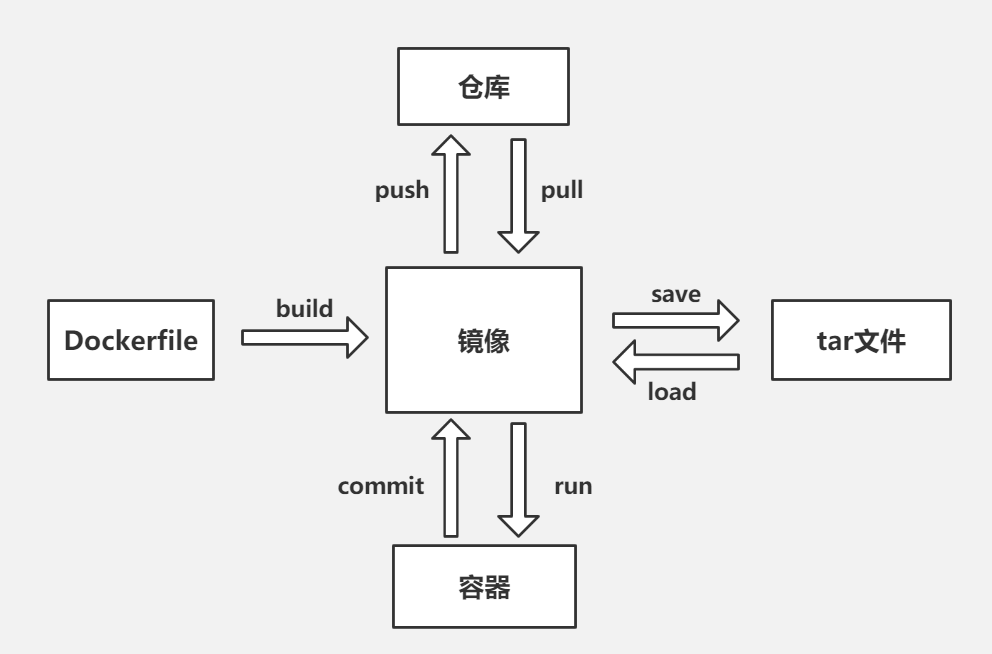
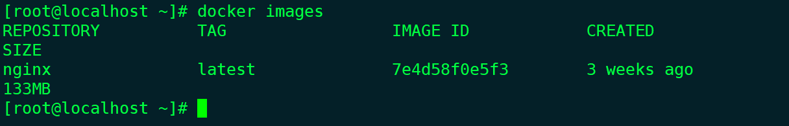
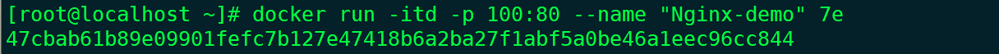
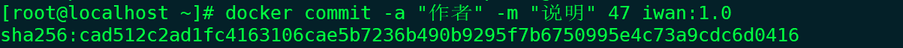

## Docker简单入门

### Docker介绍

Docker是一个开源的应用容器引擎，基于Go语言并遵从Apache2.0协议开源。Docker可以让开发者打包他们的应用以及依赖包到一个轻量级，可移植的容器中，然后发布到任何流行的Linux机器上，也可以实现虚拟化。容器是完全使用沙箱机制，相互之间不会有任何接口（类似iPhone的应用程序），更重要的是容器性能降低极低。简单的Docker就是一个类似的虚拟机。



### 启动Docker

```bash
systemctl daemon-load
systemctl restart docker
```

## Docker镜像使用

- 列出本地镜像

  ```bash
  docker images
  ```

  

- 下载镜像 Docker Hub 网址为： **https://hub.docker.com/**

  ```bash
  docker pull nginx # 这里以Nginx为例
  ```

- 删除镜像

  ```bash
  docker rmi Nginx # 这里的Nginx可以用IMAGE ID代替只要可以和其他镜像区分就可以了
  ```

  ```bash
  docker rmi 7e # 这里直接用id代替镜像
  ```

### Docker容器使用

- 启动容器

  ```bash
  docker run -itd -p 100:80 --name "NAME" 镜像ID
  ```

  

- 列出正在运行的容器

  ```bash
  docker ps
  ```

- 列出所有容器

  ```bash
  docker ps -a
  ```

- 停止容器

  ```bash
  docker stop 容器ID
  ```

- 运行停止的容器

  ```bash
  docker start 容器ID
  ```

- 提交镜像

  ```bash
  docker commit -a "作者" -m "说明" 容器ID 镜像名:版本
  ```

  

- 修改容器

  - 进入bash

  ```bash
  docker exec -it 容器ID bash
  ```

  - 退出

  ```bash
  exit
  ```

- 删除容器（要先停止容器）

  ```bash
  docker rm 容器ID
  ```

- 保存镜像

  ```bash
  docker save 容器ID>文件名.tar
  ```

- 加载镜像

  ```bash
  docker load < iwan.tar
  ```

## 参考

	https://www.bilibili.com/video/BV1R4411F7t9
	
	https://www.runoob.com/docker/docker-tutorial.html