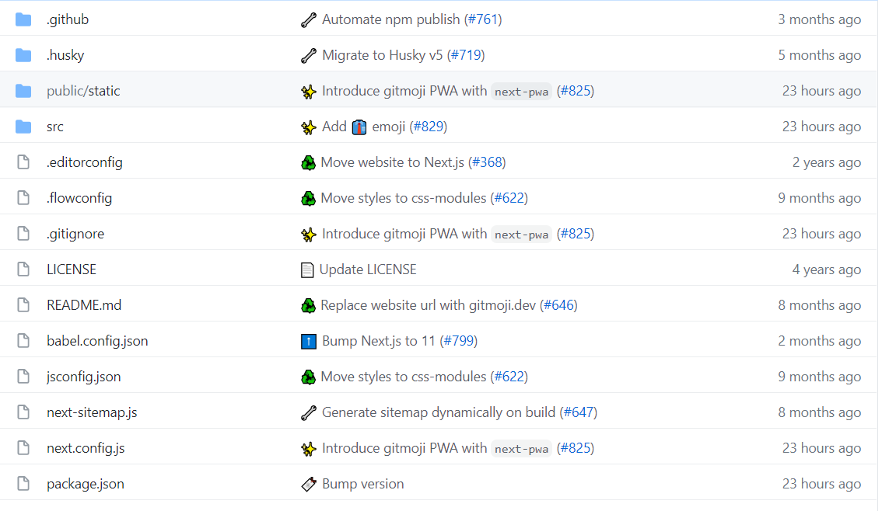

### :tada:为什么使用 Gitmoji ​​

在我们执行`git commit` 是使用 emoji 为本次提交打一个标签, 使得此次 commit 的主要工作得以凸现，也能够使得其在整个提交历史中易于区分与查找。



###  :ok_hand: Commit 提交格式

```sh
git commit -m ":emoji1: :emoji2: 不超过 50 个字的摘要，首字母大写，使用祈使语气，句末不要加句号"
```

#### 初次提交示例

```sh
git commit -m ":tada: Initialize Repo"
```

###  :memo: emoji 指南

|                    emoji                    |          emoji 代码           |                commit 说明                 |
| :-----------------------------------------: | :---------------------------: | :----------------------------------------: |
|               :tada:（庆祝）                |           `:tada:`​            |            初次提交，初始化仓库            |
|               :art:（调色板）               |            `:art:`            |           改进代码结构/代码格式            |
|                :zap:（闪电）                |            `:zap:`​            |                  提高性能                  |
|               :fire:（火焰）                |           `:fire:`​            |               删除代码或文件               |
|                :bug:（bug）                 |            `:bug:`​            |                修复一个 bug                |
|            :ambulance:（急救车）            |         `:ambulance:`​         |                  重要补丁                  |
|           :sparkles: （闪闪发光）           |         `:sparkles:`​          |                介绍新的特性                |
|              :memo:（备忘录）               |           `:memo:`​            |               添加或更新文档               |
|              :rocket:（火箭）               |          `:rocket:`​           |                  部署功能                  |
|             :lipstick:（口红）              |         `:lipstick:`​          |          添加或更新 UI 和样式文件          |
|      :white_check_mark:（白色复选框）       |     `:white_check_mark:`​      |            添加、更新或通过测试            |
|                :lock:（锁）                 |           `:lock:`​            |                修复安全问题                |
|             :bookmark:（书签）              |         `:bookmark:`          |               发布/版本标签                |
|         :rotating_light:（警告灯）          |      `:rotating_light:`​       |           修复编译器/linter警告            |
|           :construction:（施工）            |       `:construction:`​        |               工作正在进行中               |
|            :green_heart:（绿心）            |        `:green_heart:`        |                修复 CI 构建                |
|          :arrow_down:（向下箭头）           |        `:arrow_down:`​         |                 降级依赖项                 |
|           :arrow_up:（向上箭头）            |         `:arrow_up:`​          |                 升级依赖项                 |
|              :pushpin:（图钉）              |          `:pushpin:`​          |           将依赖项固定到特定版本           |
|      :construction_worker:（建筑工人）      |    `:construction_worker:`    |           添加或更新 CI 构建系统           |
|   :chart_with_upwards_trend:（上升图表）    | `:chart_with_upwards_trend:`  |             添加分析或跟踪代码             |
|            :recycle:（回收标志）            |          `:recycle:`​          |                  重构代码                  |
|          :heavy_plus_sign:（加号）          |      `:heavy_plus_sign:`​      |                 添加依赖项                 |
|         :heavy_minus_sign:（减号）          |     `:heavy_minus_sign:`​      |                 删除依赖项                 |
|              :wrench:（扳手）               |          `:wrench:`​           |             添加或更新配置文件             |
|              :hammer:（锤子）               |          `:hammer:`​           |             添加或更新开发脚本             |
|     :globe_with_meridians:（地球经络）      |   `:globe_with_meridians:`​    |               国际化和本地化               |
|              :pencil2:（铅笔）              |          `:pencil2:`​          |                 修正错别字                 |
|               :poop:（粪便）                |           `:poop:`​            |           编写需要改进的糟糕代码           |
|            :rewind:（还原按钮）             |          `:rewind:`           |                  还原更改                  |
| :twisted_rightwards_arrows:（随机播放按钮） | `:twisted_rightwards_arrows:` |                  合并分支                  |
|              :package:（包裹）              |          `:package:`          |         添加或更新已编译的文件或包         |
|              :alien:（外星人）              |           `:alien:`​           |        由于外部 API 更改而更新代码         |
|              :truck:（送货车）              |           `:truck:`​           | 移动或重命名资源（例如：文件、路径、路由） |
|          :page_facing_up:（页面）           |      `:page_facing_up:`​       |              添加或更新许可证              |
|               :boom:（爆炸）                |           `:boom:`​            |                引入重大改变                |
|              :bento:（便当盒）              |           `:bento:`​           |               添加或更新资产               |
|          :wheelchair:（轮椅标志）           |        `:wheelchair:`​         |                提高可访问性                |
|              :bulb:（电灯泡）               |           `:bulb:`​            |          在源代码中添加或更新注释          |
|               :beers:（碰杯）               |           `:beers:`​           |              没有考虑的写代码              |
|        :speech_balloon:（语音气球）         |      `:speech_balloon:`​       |            添加或更新文本和文字            |
|        :card_file_box:（卡片档案盒）        |       `:card_file_box:`​       |           执行与数据库相关的更改           |
|            :loud_sound:（声音）             |        `:loud_sound:`​         |               添加或更新日志               |
|               :mute:（静音）                |           `:mute:`​            |                  删除日志                  |
|       :busts_in_silhouette:（剪影像）       |    `:busts_in_silhouette:`​    |            添加或更新贡献者/们             |
|      :children_crossing:（儿童交叉口）      |     `:children_crossing:`​     |            改善用户体验/可用性             |
|     :building_construction:（建筑工程）     |   `:building_construction:`   |                进行架构更改                |
|              :iphone:（手机）               |          `:iphone:`​           |                 移动端设计                 |
|           :clown_face:（小丑脸）            |        `:clown_face:`​         |                 模拟的东西                 |
|                :egg:（鸡蛋）                |            `:egg:`​            |            添加或更新复活节彩蛋            |
|           :see_no_evil:（看不见）           |        `:see_no_evil:`        |         添加或更新 .gitignore 文件         |
|         :camera_flash:（闪光相机）          |       `:camera_flash:`​        |               添加或更新快照               |
|             :alembic:（蒸馏瓶）             |          `:alembic:`​          |                  进行实验                  |
|                :mag:（搜索）                |            `:mag:`​            |          提高搜索引擎优化（SEO）           |
|               :label:（标签）               |           `:label:`​           |               添加或更新类型               |
|             :seedling:（幼苗）              |         `:seedling:`​          |         添加或更新种子（模板）文件         |
|    :triangular_flag_on_post:（三角旗杆）    |  `:triangular_flag_on_post:`​  |          添加、更新或删除功能标志          |
|            :goal_net:（目标网）             |         `:goal_net:`​          |                  捕捉错误                  |
|               :dizzy:（眩晕）               |           `:dizzy:`​           |            添加或更新动画和过渡            |
|           :wastebasket:（废纸篓）           |        `:wastebasket:`​        |             弃用需要清理的代码             |
|       :passport_control:（护照检查）        |     `:passport_control:`​      |      处理与授权、角色和权限相关的代码      |
|                🩹（胶布绷带）                |     `:adhesive_bandage:`      |         - 对非关键问题的简单修复 -         |
|           :monocle_face:（查看）            |       `:monocle_face:`        |             - 数据探索/检查 -              |
|              :coffin:（棺材）               |          `:coffin:`​           |               删除失效的代码               |
|             :test_tube:（试管）             |         `:test_tube`          |             - 添加失败的测试 -             |
|              :necktie:（领带）              |          `:necktie:`​          |             添加或更新业务逻辑             |


### 🔍 参考

https://github.com/carloscuesta/gitmoji

https://github.com/liuchengxu/git-commit-emoji-cn


### 🌐 emoji 网站

https://gitmoji.dev/

http://emojihomepage.com/

https://emojipedia.org/
