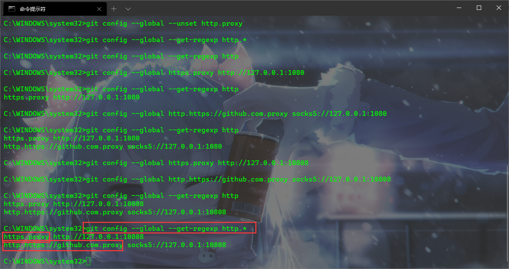

# Git 代理设置

## 显示所有`http`部分的当前配置

```bash
git config --global --get-regexp http.*
```



## 设置代理

```bash
git config --global https.proxy http://127.0.0.1:10808
```

```bash
git config --global http.https://github.com.proxy socks5://127.0.0.1:10808
```

```bash
git config --global http.proxy 'socks5://127.0.0.1:10808'
git config --global https.proxy 'socks5://127.0.0.1:10808'
```

## 取消代理

> key 为上图的 https.proxy 或 http.https://github.com.proxy

```bash
git config --global --unset <key>
```

