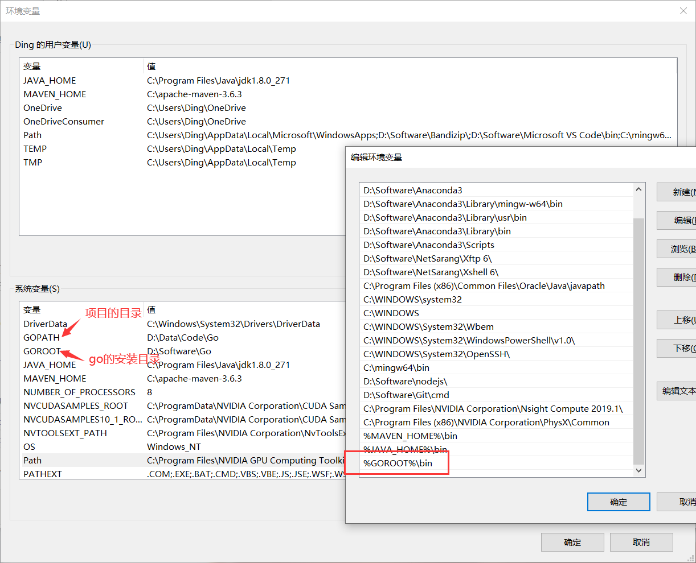

# Go 环境的安装（Windows）

## 1. 下载安装包

https://golang.org/dl/

## 2. 环境变量

`GOPATH`写代码的目录，需要添加 src、bin、pkg 目录

`GOROOT`Go的安装目录



## 3. 第一 Go 程序

```go
package main // 声明 main 包

import (
	"fmt"    // 导入 fmt 包
)

func main() {// 声明 main 主函数
	fmt.Print("Hello World！")
}
```

