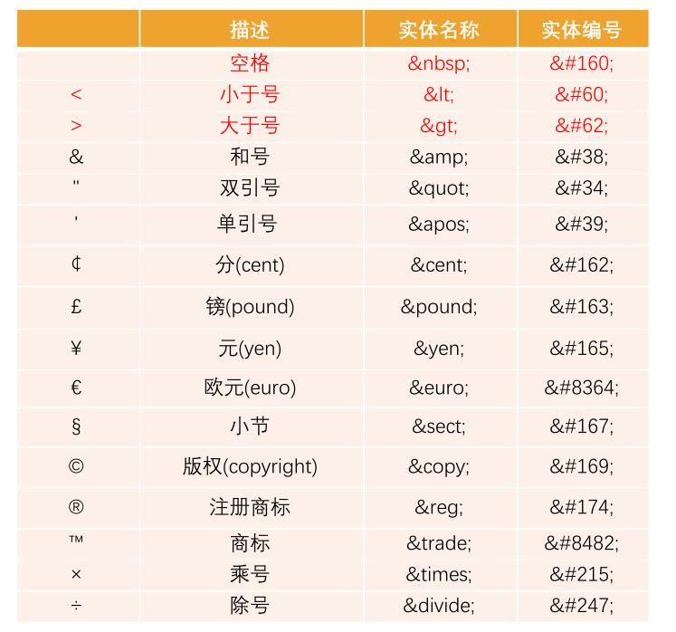
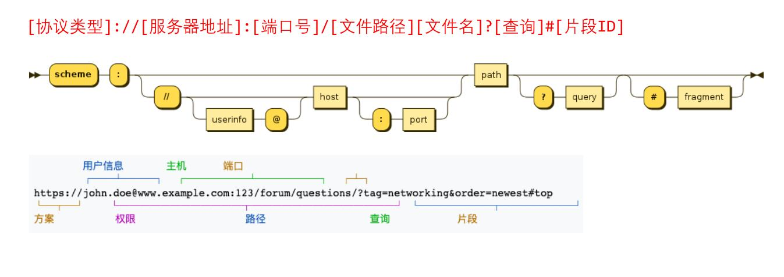

# 1、 字符实体

# 2、 URL 和 URI
## 2.1 URL 统一资源定位符（Uniform Resource Locator)
- 每个有效的 URL 都指向一个唯一的资源
- 资源可以是 HTML 页面、CSS 文档、图片 等等
### 2.1.1 URL 的格式

## 2.2 URI 统一资源标志符(Uniform Resource Identifier)
### 2.2.1 URL 和 URI 的区别
- URI = Uniform Resource Identifier 统一资源标志符，**用于标识 Web 技术使用的逻辑或物理资源**。
- URL = Uniform Resource Locator 统一资源定位符，俗称**网络地址**，相当于网络中的门牌号；
- URL 是 URI 的一个子集

# 3、 元素的语义化
> 用正确的元素做正确的事情
- 方便代码维护
- 减少开发者之间沟通的成本
- 语音合成工具的识别
- 有利于 SEO
- ...
