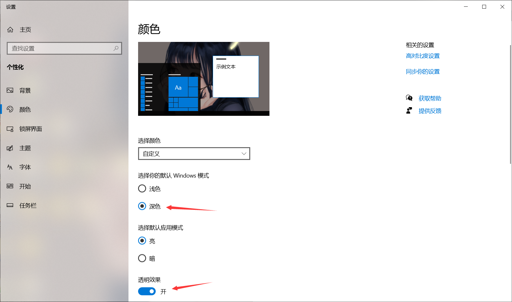
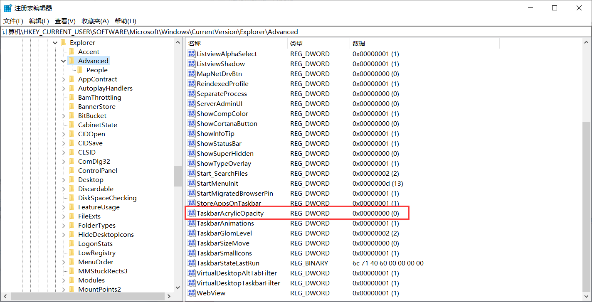

# Win10 任务栏透明

## 1. 个性化 颜色

## 2. 打开注册表编辑器

- 路径 计算机\HKEY_CURRENT_USER\SOFTWARE\Microsoft\Windows\CurrentVersion\Explorer\Advanced
- 找到`TaskbarAcrylicOpacity`，没有就右键新建一个DWORD（32位）值 D
- 将值修改为十进制0就是全透明，也可以是十进制0-10之间的效果。

## 3. 任务管理器，重启Windows资源管理器