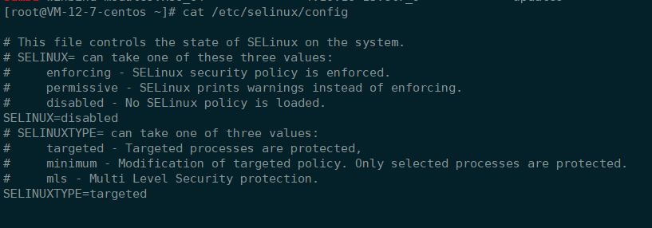
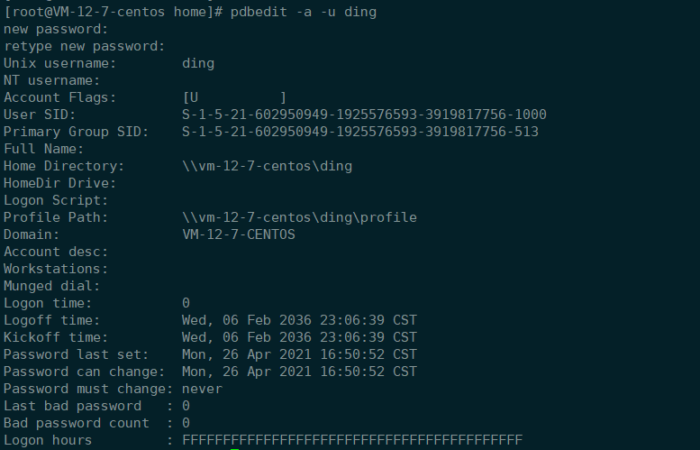

# Samba 安装和使用

> Centos 7

### 1. 安装 Samba

```bash
yum install -y samba
```

### 2. 查看 Samba 版本

```bash
yum list | grep samba
```

### 3. 关闭SELIUNX

>  修改配置文件/etc/selinux/config，将SELINU置为disabled



### 4. 相关命令

> 查看 smb 服务状态

```bash
service smb status
```

> 启动 smb 服务

```bash
systemctl start smb
```

> 设置开机启动

```bash
systemctl enable smb
```

### 5. 配置 Samba 服务

#### 5.1 添加系统用户

```bash
useradd ding
```

```bash
id ding
```

#### 5.2 修改配置文件

> /etc/samba/smb.conf

```
[workspace]
        comment = This is ding
        path = /home/ding
        public = no
        write list = ding
```

#### 5.3 添加 Samba 用户(需要在系统中存在)

> 这里设置的密码是和系统的密码是分开的

```bash
pdbedit -a -u ding
```



### 6. 启动 Samba 服务

```bash
systemctl start smb
```

