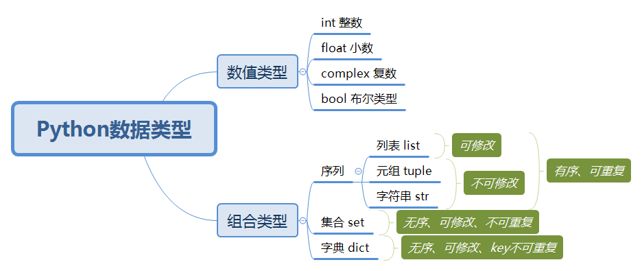

# Python 数据类型

### 列表

- 列表：用于存储任意数目、任意类型的数据集合。

- 创建

	```python
	>>> a = [1, 2, 3, 'a']
	>>> a
	[1, 2, 3, 'a']
	```

- 增加元素

	```python
	>>> a.append(6)
	>>> a
	[1, 2, 3, 'a', 6]
	```

	```python
	>>> b = [9, 8, 7]
	>>> a.extend(b)
	>>> a
	[1, 2, 3, 'a', 6, 9, 8, 7]
	```

	```python
	[1, 2, 3, 'a', 6, 9, 8, 7]
	>>> a.insert(3, 'b')
	>>> a
	[1, 2, 3, 'b', 'a', 6, 9, 8, 7]
	```

- 删除元素

	```python
	[1, 2, 3, 'b', 'a', 6, 9, 8, 7]
	>>> a.remove('a')
	>>> a
	[1, 2, 3, 'b', 6, 9, 8, 7]
	```

	```python
	[1, 2, 3, 'b', 6, 9, 8, 7]
	>>> a.pop(3)
	'b'
	>>> a
	[1, 2, 3, 6, 9, 8, 7]
	```

	```python
	[1, 2, 3, 9, 8, 7]
	>>> a.clear()
	>>> a
	[]
	```

- 访问元素

	> 返回元素索引

	```python
	[1, 2, 3, 'a']
	>>> a.index('a')
	3
	```

- 计数

	> 返回元素在列表中出现的次数

	```python
	>>> a = [1, 2, 3, 3, 3, 4]
	>>> a.count(3)
	3
	```

- 列表长度

	```python
	>>> a
	[1, 2, 3, 3, 3, 4]
	>>> len(a)
	6
	```

- 翻转列表

	```python
	>>> a
	[1, 2, 3]
	>>> a.reverse()
	>>> a
	[3, 2, 1]
	```

- 排序

	```python
	>>> a = [2, 1, 3]
	>>> a.sort()
	>>> a
	[1, 2, 3]
	```

### 元组

- 创建

	```python
	>>> a = (1, 2, 3)
	>>> a
	(1, 2, 3)
	>>> a = tuple('python')
	>>> a
	('p', 'y', 't', 'h', 'o', 'n')
	```

### 集合

- 创建

	```python
	>>> a = {1, 2, 3}
	>>> a
	{1, 2, 3}
	```

	> 不可重复

	```python
	>>> a = {1, 1, 2, 3}
	>>> a
	{1, 2, 3}
	```

- 增加元素

	```python
	>>> a
	{1, 2, 3}
	>>> a.add('a')
	>>> a
	{1, 2, 3, 'a'}
	```

- 删除元素

	```python
	>>> a.remove('a')
	>>> a
	{1, 2, 3}
	```

### 字典

- 创建

	```python
	>>> a = {'name': 'aiwan', 'age': 18}
	>>> a
	{'name': 'aiwan', 'age': 18}
	```

- 访问值

	```python
	>>> a
	{'name': 'aiwan', 'age': 18}
	>>> a['name']
	'aiwan'
	```

- 修改字典

	```python
	>>> a
	{'name': 'aiwan', 'age': 18}
	>>> a['age'] = 20
	>>> a
	{'name': 'aiwan', 'age': 20}
	```

- 删除字典元素

	```python
	>>> a
	{'name': 'aiwan', 'age': 20}
	>>> del a['age']
	>>> a
	{'name': 'aiwan'}
	```

- 元素个数

	```python
	>>> a
	{'name': 'aiwan', 'age': 18}
	>>> len(a)
	2
	```

- 删除所有元素

	```python
	>>> a
	{'name': 'aiwan', 'age': 18}
	>>> a.clear()
	>>> a
	{}
	```

- 是否存在键值

	```python
	>>> a
	{'name': 'aiwan', 'age': 18}
	>>> 'name' in a
	True
	```

	
