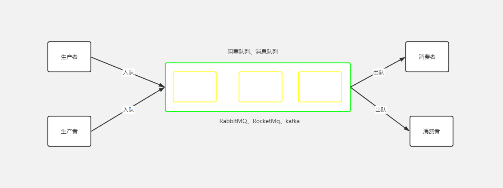

# Python 多线程


### 程序、进程、线程

- 程序
  - 静态的代码
  - 程序运行后至少创建进程
- 进程
  - 执行起来的代码
  - 程序的执行实例、动态的
  - 进程占用内存资源
  - 一个进程至少包含一个线程
- 线程
  - 程序执行流的最小资源
   - 是CPU的可执行上下文
   - 同一个进程中的线程共享同一内存资源
   - 线程数据的安全性需要保护
- 多线程
  - 在单个程序中同时运行多个线程完成不同的被划分成一块一块的工作，称为多线程

### Python多线程的应用

- 继承 Thread

  ```python
  import threading
  
  
  class MyThread(threading.Thread):
      def __init__(self, thread_name):
          super(MyThread, self).__init__(name=thread_name)
  
      def run(self):
          print("%s 在执行中..." % self.name)
  
  
  for i in range(10):
      MyThread("testThread" + str(i)).start()
  
  ```

- 直接调用

  ```python
  import threading
  
  
  def show(num):
      print('当前线程: %d 在执行...' % num)
  
  
  for i in range(10):
      t = threading.Thread(target=show, args=(i,))
      t.start()
  
  ```

- 子线程合并到主线程，线程合并

  ```python
  import threading
  import time
  
  
  def doWaiting():
      print('子线程开始等待...')
      time.sleep(3)
      print('子线程等待结束...')
  
  
  print('主线程开始')
  t = threading.Thread(target=doWaiting)
  t.start()
  print('主线程的其他操作')
  t.join()
  print('主线程结束')
  
  ```

- 守护进程，主进程结束子进程立即结束

  ```python
  import threading
  import time
  
  
  def doWaiting():
      print(threading.current_thread().getName() + '子线程开始等待...')
      time.sleep(3)
      print(threading.current_thread().getName() + '子线程等待结束...')
  
  
  print('主线程开始')
  for i in range(3):
      t = threading.Thread(target=doWaiting)
      t.setDaemon(True)
      t.start()
  
  print('主线程结束')
  
  ```


### 线程安全与线程锁

- 不安全

  ```python
  import threading
  import time
  
  number = 0
  
  
  def add():
      global number
      for _ in range(1000000):
          number += 1
      print('子线程 %s 执行结束: number = %d' % (threading.current_thread().getName(), number))
  
  
  for i in range(2):
      t = threading.Thread(target=add)
      t.start()
  
  time.sleep(3)
  print('主线程结束，number = %d' % number)
  
  ```

- 合并线程，不是并发

  ```python
  import threading
  import time
  
  number = 0
  
  
  def add():
      global number
      for _ in range(1000000):
          number += 1
      print('子线程 %s 执行结束: number = %d' % (threading.current_thread().getName(), number))
  
  
  for i in range(2):
      t = threading.Thread(target=add)
      t.start()
      t.join()
  
  time.sleep(3)
  print('主线程结束，number = %d' % number)
  
  ```

- 线程锁 互斥锁Lock

  ```python
  import threading
  import time
  
  number = 0
  lock = threading.Lock()
  
  
  def add(lk):
      global number
      # 加锁
      lk.acquire()
      for _ in range(1000000):
          number += 1
      print('子线程 %s 执行结束: number = %d' % (threading.current_thread().getName(), number))
      # 解锁
      lk.release()
  
  
  for i in range(2):
      t = threading.Thread(target=add, args=(lock,))
      t.start()
  
  time.sleep(3)
  print('主线程结束，number = %d' % number)
  
  ```

  ```python
  import threading
  import time
  
  number = 0
  lock = threading.Lock()
  
  
  def add(lk):
      global number
      # 加锁
      with lk:
          for _ in range(1000000):
              number += 1
          print('子线程 %s 执行结束: number = %d' % (threading.current_thread().getName(), number))
  
  
  for i in range(2):
      t = threading.Thread(target=add, args=(lock,))
      t.start()
  
  time.sleep(3)
  print('主线程结束，number = %d' % number)
  
  ```

### 生产者与消费者



