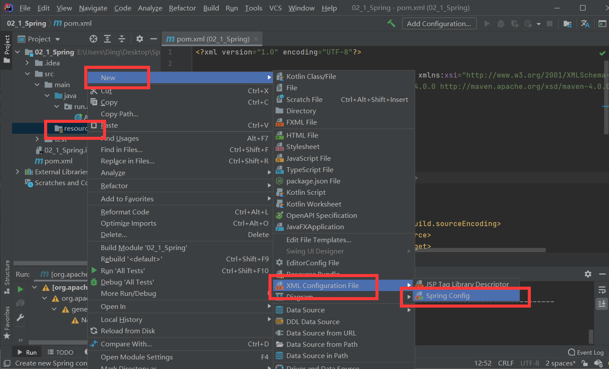

# IoC 控制反转

​	控制反转（IoC，Inversion of Control），是一个概念，是一种思想。指将传统上由程序代码直接操控的对象调用权交给容器，通过容器来实现对象的装配和管理。控制反转就是对对 象控制权的转移，从程序代码本身反转到了外部容器。通过容器实现对象的创建，属性赋值， 依赖的管理。

​	IoC 是一个概念，是一种思想，其实现方式多种多样。当前比较流行的实现方式是依赖
注入。应用广泛。

​	依赖注入：DI(Dependency Injection)，程序代码不做定位查询，这些工作由容器自行 完成。

​	依赖注入 DI 是指程序运行过程中，若需要调用另一个对象协助时，无须在代码中创建
被调用者，而是依赖于外部容器，由外部容器创建后传递给程序。 Spring 的依赖注入对调用者与被调用者几乎没有任何要求，完全支持对象之间依赖关系的管理。 

​	Spring 框架使用依赖注入（DI）实现 IoC。

​	Spring 容器是一个超级大工厂，负责创建、管理所有的 Java 对象，这些 Java 对象被称为 Bean。Spring 容器管理着容器中 Bean 之间的依赖关系，Spring 使用“依赖注入”的方式 来管理 Bean 之间的依赖关系。使用 IoC 实现对象之间的解耦合。

## 1 第一个 Spring 程序

- 添加pom.xml依赖

```xml
<!--spring-->
<dependency>
    <groupId>org.springframework</groupId>
    <artifactId>spring-context</artifactId>
    <version>5.2.5.RELEASE</version>
</dependency>
```

- 添加SomeService接口和实现类

- 创建Spring配置文件



```xml
<?xml version="1.0" encoding="UTF-8"?>
<beans xmlns="http://www.springframework.org/schema/beans"
       xmlns:xsi="http://www.w3.org/2001/XMLSchema-instance"
       xsi:schemaLocation="http://www.springframework.org/schema/beans http://www.springframework.org/schema/beans/spring-beans.xsd">
    <bean id="someService" class="run.aiwan.service.impl.SomeServiceImpl" />
</beans>
```

- 定义测试类

```java
public void test02() {
    // 1. 配置文件
    String config = "applicationContext.xml";
    // 2. 创建表示spring容器的对象， ApplicationContext
    // ApplicationContext就是表示Spring容器，通过容器获取对象了
    // ClassPathXmlApplicationContext:表示从类路径中加载spring的配置文件
    ApplicationContext ac = new ClassPathXmlApplicationContext(config);
    // 3. 从容器中获取某个对象， 你要调用的对象
    // getBean("配置文件中的bean的id值")
    SomeService service = (SomeService) ac.getBean("someService");
    service.doSome();
}
```

- 获取spring容器中java对象的信息

```java
public void test04() {
    String config = "applicationContext.xml";
    ApplicationContext ac = new ClassPathXmlApplicationContext(config);

    // 容器中对象的数量
    int nums = ac.getBeanDefinitionCount();
    System.out.println("容器中对象的数量 " + nums);

    // 容器中对象的名称
    String[] names = ac.getBeanDefinitionNames();
    for (String name: names) {
        System.out.println("容器中对象的名称 " + name);
    }
}
```
