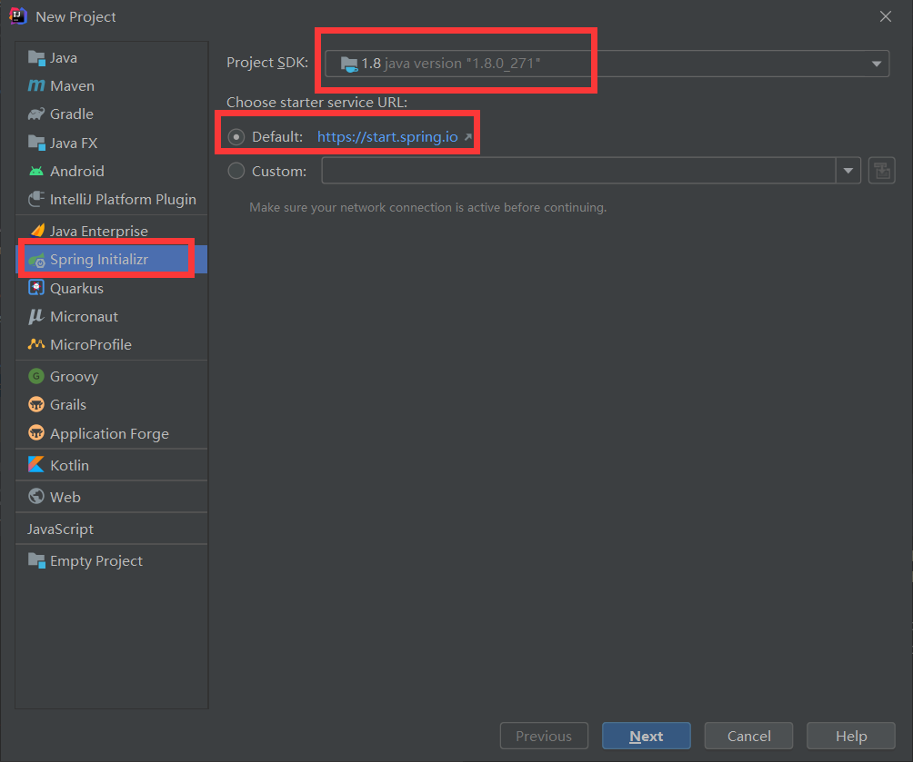
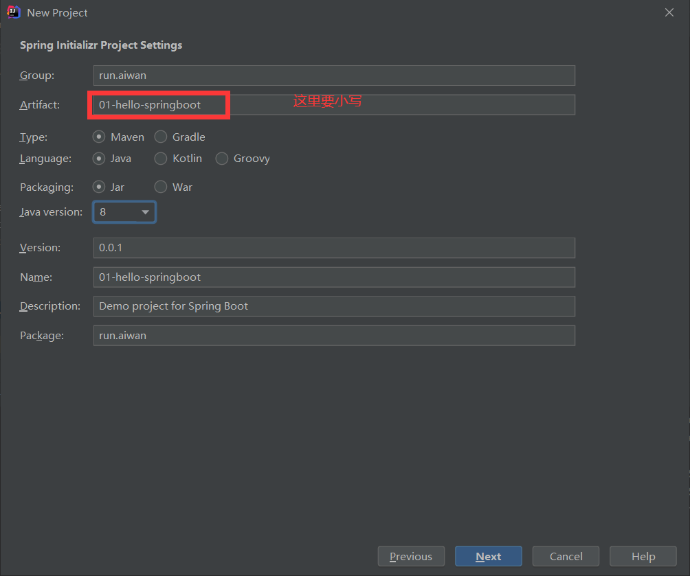
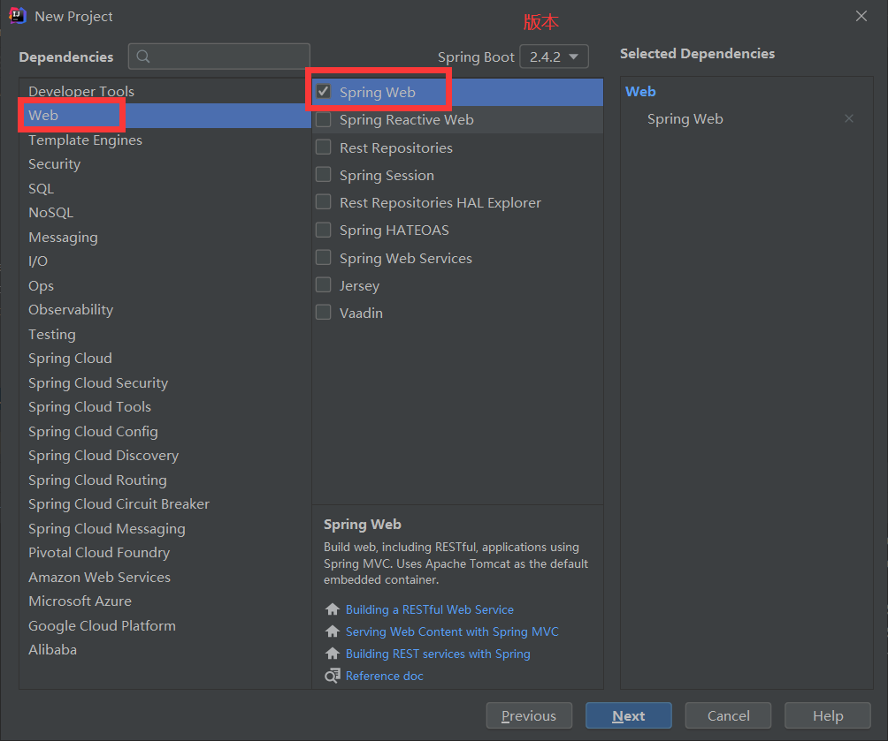
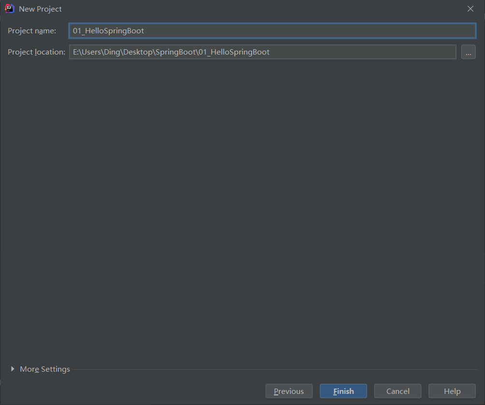
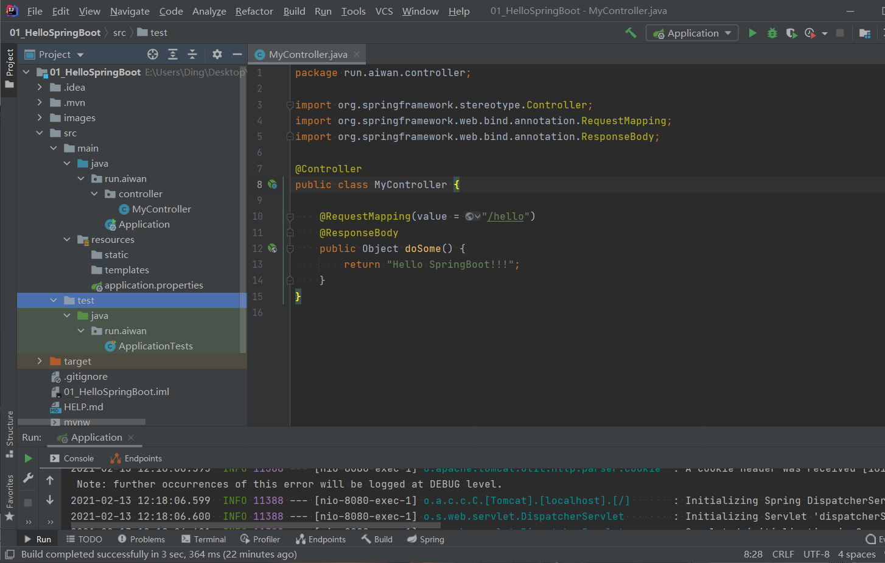

# SpringBoot 项目

## 1.1 Spring Boot 简介

Spring Boot 是 Spring 家族中的一个全新的框架，它用来简化 Spring 应用程序的创建和开发过程，也可以说 Spring Boot 能简化我们之前采用 SpringMVC + Spring + MyBatis 框架进行 开发的过程。 

在以往我们采用 SpringMVC + Spring + MyBatis 框架进行开发的时候，搭建和整合三大框架，我们需要做很多工作，比如配置 web.xml，配置 Spring，配置MyBatis，并将它们整合在 一起等，而 Spring Boot 框架对此开发过程进行了革命性的颠覆，完全抛弃了繁琐的 xml 配 置过程，采用大量的默认配置简化我们的开发过程。 

所以采用 Spring Boot 可以非常容易和快速地创建基于 Spring 框架的应用程序，它让编码变简单了，配置变简单了，部署变简单了，监控变简单了。正因为 Spring Boot 它化繁为 简，让开发变得极其简单和快速，所以在业界备受关注。

## 1.2 Spring Boot 的特性

- 能过快速创建基于 Spring 的应用程序
- 能够直接使用 java main 方法启动内嵌的 Tomcat 服务器运行 Spring Boot 程序，不需要部署 war 包文件
- 提供约定的 starter POM 来简化 Maven 配置，让 Maven 的配置变得简单
- 自动化配置，根据项目的 Maven 依赖配置，Spring Boot 自动配置 Spring、Spring MVC等
- 提供了程序的健康检查等功能
- 基本可以完全不使用 XML 配置文件，采用注解配置

## 1.3 Spring Boot 四大核心

- 自动配置
- 起步依赖
- Actuator
- 命令行界面

## 1.4 新建一个 SpringBoot 项目

### 1.4.1 New Project



### 1.4.2 Spring Initializtr Project Settings



### 1.4.3 Dependencies



### 1.4.4 项目名存放位置



### 1.4.5 项目结构



static：存放静态资源，如图片、CSS、JavaScript 等 

templates：存放Web页面的模板文件 

application.properties/application.yml 用于存放程序的各种依赖模块的配置信息，比如 服务 端口，数据库连接配置等

### 1.4.6 Controller

```java
package run.aiwan.controller;

import org.springframework.stereotype.Controller;
import org.springframework.web.bind.annotation.RequestMapping;
import org.springframework.web.bind.annotation.ResponseBody;

@Controller
public class MyController {

    @RequestMapping(value = "/hello")
    @ResponseBody
    public Object doSome() {
        return "Hello SpringBoot!!!";
    }
}

```

### 1.4.7 Application

```java
package run.aiwan;

import org.springframework.boot.SpringApplication;
import org.springframework.boot.autoconfigure.SpringBootApplication;
// SpringBoot 项目启动入口类
// SpringBoot 核心注解，用于开启SpringBoot自动配置
@SpringBootApplication
public class Application {

    public static void main(String[] args) {
        SpringApplication.run(Application.class, args);
    }

}

```

