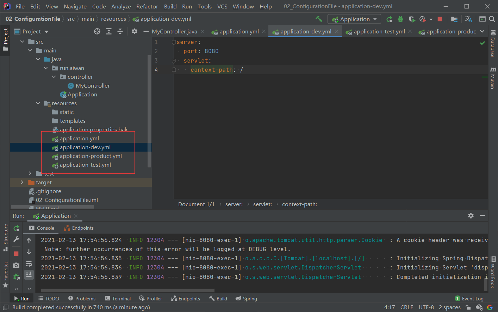

# SpringBoot 核心配置文件

## 1. 默认配置文件 application.properties 文件

```properties
# 设置内嵌 Tomcat 端口号
server.port=8081

# 设置项目上下文根
server.servlet.context-path=/
```

## 2. application.yml 或 .yaml

```yml
server:
  port: 8083
  servlet:
    context-path: /
```

## 3. 多环境配置

不同的环境（开发、测试、上线）有不同的配置文件



> application.xml

```yml
spring:
  profiles:
    active: dev
```

用来指定当前的环境，注意环境的配置文件名称，**aplication-\<name>.yml**

## 4. SpringBoot 自定义配置

可以自己在配置文件中设置值，可以在类中通过 @Value 注解获取值

```yml
server:
  port: 8080
  servlet:
    context-path: /

# 自定义配置文件
student:
  name: foo
  age: 21
```

```java
package run.aiwan.controller;

import org.springframework.beans.factory.annotation.Value;
import org.springframework.stereotype.Controller;
import org.springframework.web.bind.annotation.RequestMapping;
import org.springframework.web.bind.annotation.ResponseBody;

@Controller
public class MyController {

    @Value("${student.name}")
    private String StudentName;

    @Value("${student.age}")
    private Integer StudentAge;

    @RequestMapping("/hello")
    public @ResponseBody  Object doSome() {

        return StudentName + StudentAge;
    }
}

```

## 5. 将多个配置映射成一个对象

> application-dev.yml

```yml
server:
  port: 8080
  servlet:
    context-path: /

# 自定义配置文件
student:
  name: bar
  age: 21
```

> 定义 Student 类
>
> 注意使用 @Component 和 @ConfigurationProperties 注解

```java
package run.aiwan.domain;

import org.springframework.boot.context.properties.ConfigurationProperties;
import org.springframework.stereotype.Component;

@Component
@ConfigurationProperties(prefix = "student")
public class Student {

    private String name;
    private Integer age;

    public String getName() {
        return name;
    }

    public void setName(String name) {
        this.name = name;
    }

    public Integer getAge() {
        return age;
    }

    public void setAge(Integer age) {
        this.age = age;
    }
}
```

会出现一个问题这里可以添加依赖解决

```xml
<?xml version="1.0" encoding="UTF-8"?>
<project xmlns="http://maven.apache.org/POM/4.0.0" xmlns:xsi="http://www.w3.org/2001/XMLSchema-instance"
         xsi:schemaLocation="http://maven.apache.org/POM/4.0.0 https://maven.apache.org/xsd/maven-4.0.0.xsd">
    <modelVersion>4.0.0</modelVersion>
    <parent>
        <groupId>org.springframework.boot</groupId>
        <artifactId>spring-boot-starter-parent</artifactId>
        <version>2.4.2</version>
        <relativePath/> <!-- lookup parent from repository -->
    </parent>
    <groupId>run.aiwan</groupId>
    <artifactId>02-configuration-file</artifactId>
    <version>0.0.1</version>
    <name>02-configuration-file</name>
    <description>Demo project for Spring Boot</description>
    <properties>
        <java.version>1.8</java.version>
    </properties>
    <dependencies>

        <!--解决使用 @ConfigurationProperties 注解警告问题-->
        <dependency>
            <groupId>org.springframework.boot</groupId>
            <artifactId>spring-boot-configuration-processor</artifactId>
            <optional>true</optional>
        </dependency>

        <dependency>
            <groupId>org.springframework.boot</groupId>
            <artifactId>spring-boot-starter-web</artifactId>
        </dependency>

        <dependency>
            <groupId>org.springframework.boot</groupId>
            <artifactId>spring-boot-starter-test</artifactId>
            <scope>test</scope>
        </dependency>
    </dependencies>

    <build>
        <plugins>
            <plugin>
                <groupId>org.springframework.boot</groupId>
                <artifactId>spring-boot-maven-plugin</artifactId>
            </plugin>
        </plugins>
    </build>

</project>
```

> MyController

```java
package run.aiwan.controller;

import org.springframework.beans.factory.annotation.Value;
import org.springframework.stereotype.Controller;
import org.springframework.web.bind.annotation.RequestMapping;
import org.springframework.web.bind.annotation.ResponseBody;
import run.aiwan.domain.Student;

import javax.annotation.Resource;

@Controller
public class MyController {

    @Value("${student.name}")
    private String StudentName;

    @Value("${student.age}")
    private Integer StudentAge;

    @Resource
    private Student student;

    @RequestMapping("/hello")
    public @ResponseBody  Object doSome() {
        return this.student.getName() + this.student.getAge();
    }
}
```

