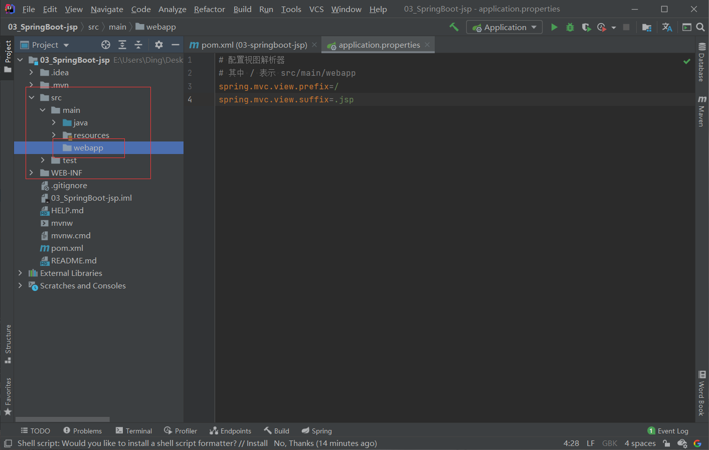
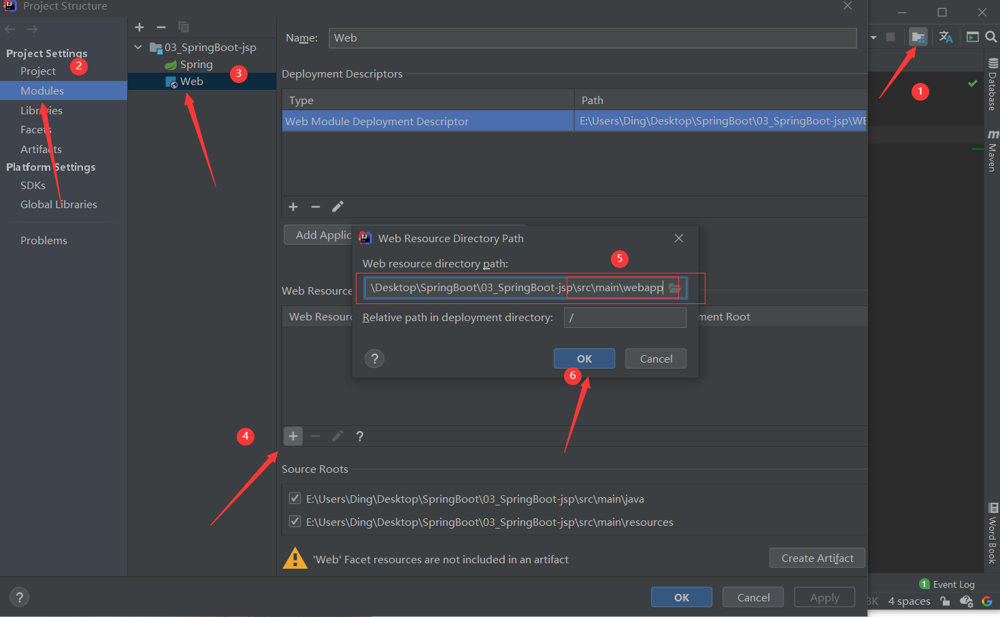

# Spring Boot 前端使用 JSP

## 1. 添加 Maven 依赖

SpringBoot 要求 jsp 文件必须编译到指定的 META-INF/resources 目录下才能访问，否则
访问不到。其实官方已经更建议使用模板技术（后面会讲模板技术）

```xml
<?xml version="1.0" encoding="UTF-8"?>
<project xmlns="http://maven.apache.org/POM/4.0.0" xmlns:xsi="http://www.w3.org/2001/XMLSchema-instance"
         xsi:schemaLocation="http://maven.apache.org/POM/4.0.0 https://maven.apache.org/xsd/maven-4.0.0.xsd">
    <modelVersion>4.0.0</modelVersion>
    <parent>
        <groupId>org.springframework.boot</groupId>
        <artifactId>spring-boot-starter-parent</artifactId>
        <version>2.4.2</version>
        <relativePath/> <!-- lookup parent from repository -->
    </parent>

    <groupId>run.aiwan</groupId>
    <artifactId>03-springboot-jsp</artifactId>
    <version>0.0.1</version>
    <name>03-springboot-jsp</name>
    <description>Demo project for Spring Boot</description>

    <properties>
        <java.version>1.8</java.version>
    </properties>

    <dependencies>
        <!--SpringBoot框架Web项目起步依赖-->
        <dependency>
            <groupId>org.springframework.boot</groupId>
            <artifactId>spring-boot-starter-web</artifactId>
        </dependency>

        <dependency>
            <groupId>org.springframework.boot</groupId>
            <artifactId>spring-boot-starter-test</artifactId>
            <scope>test</scope>
        </dependency>

        <!--引入SpringBoot内嵌Tomcat对jsp的解析依赖,不添加解析不了jsp-->
        <!--仅仅只是展示jsp页面,只添加以下一个依赖-->
        <dependency>
            <groupId>org.apache.tomcat.embed</groupId>
            <artifactId>tomcat-embed-jasper</artifactId>
        </dependency>

    </dependencies>

    <build>

        <!--
            Springboot项目默认推荐使用的前端引擎是thymeleaf
            现在我们要使用springboot集成jsp,手动指定jsp最后编译的路径
            而且springboot集成jsp编译jsp的路径是springboot规定好的位置
            META-INF/resources
        -->
        <resources>
            <resource>
                <!--源文夹-->
                <directory>src/main/webapp</directory>
                <!--指定编译到META-INF/resources-->
                <targetPath>META-INF/resources</targetPath>
                <!--指定要把哪些文件编译进去，**表示webapp目录及子目录，*.*表示所有文件-->
                <includes> <include>**/*.*</include>
            </includes>
            </resource>
        </resources>

        <plugins>
            <plugin>
                <groupId>org.springframework.boot</groupId>
                <artifactId>spring-boot-maven-plugin</artifactId>
            </plugin>
        </plugins>
    </build>

</project>
```

## 2. 配置视图解析器

> application.properties

```properties
# 配置视图解析器
# 其中 / 表示 src/main/webapp
spring.mvc.view.prefix=/
spring.mvc.view.suffix=.jsp
```

## 3. 创建 webapp 文件夹

- 新建 webapp 目录



- 设置 web 资源文件夹



## 4. Controller

```java
package run.aiwan.controller;

import org.springframework.stereotype.Controller;
import org.springframework.web.bind.annotation.RequestMapping;
import org.springframework.web.servlet.ModelAndView;

@Controller
public class MyController {
    @RequestMapping(value = "/say")
    public ModelAndView say() {
        ModelAndView mv = new ModelAndView();
        mv.addObject("msg", "Hello SpringBoot!!!");
        mv.setViewName("say");
        return mv;
    }
}
```

## 5. say.jsp

> webapp/say.jsp

```jsp
<%@ page contentType="text/html;charset=UTF-8" language="java" %>
<html>
<head>
    <title>Title</title>
</head>
<body>
msg ${msg}
</body>
</html>
```