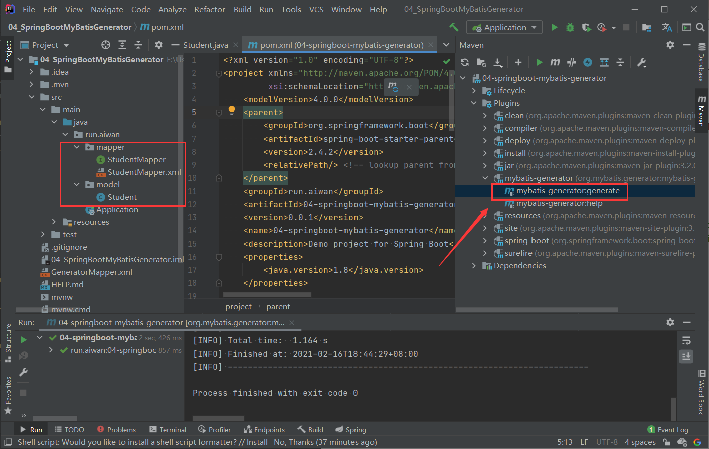

# Spring Boot 集成 MyBatis 逆向工程

> _sql SQL 源文件

## 1. 添加 GeneratorMapper.xml 文件

> GeneratorMapper.xml
>
> 注意修改配置文件内容， 指定mysql-connector-java-5.1.9.jar位置,

```xml
<?xml version="1.0" encoding="UTF-8"?>
<!DOCTYPE generatorConfiguration
        PUBLIC "-//mybatis.org//DTD MyBatis Generator Configuration 1.0//EN"
        "http://mybatis.org/dtd/mybatis-generator-config_1_0.dtd">
<generatorConfiguration>
    <!-- 指定连接数据库的 JDBC 驱动包所在位置，指定到你本机的完整路径 -->
    <classPathEntry location="D:\mysql-connector-java-5.1.9.jar"/>
    <!-- 配置 table 表信息内容体，targetRuntime 指定采用 MyBatis3 的版本 -->
    <context id="tables" targetRuntime="MyBatis3">
        <!-- 抑制生成注释，由于生成的注释都是英文的，可以不让它生成 -->
        <commentGenerator>
            <property name="suppressAllComments" value="true"/>
        </commentGenerator>
        <!-- 配置数据库连接信息 -->
        <jdbcConnection driverClass="com.mysql.jdbc.Driver"
                        connectionURL="jdbc:mysql://192.168.154.128:3306/springboot"
                        userId="root"
                        password="111111">
        </jdbcConnection>
        <!-- 生成 model 类，targetPackage 指定 model 类的包名， targetProject 指定
        生成的 model 放在 eclipse 的哪个工程下面-->
        <javaModelGenerator targetPackage="run.aiwan.model"
                            targetProject="src/main/java">
            <property name="enableSubPackages" value="false"/>
            <property name="trimStrings" value="false"/>
        </javaModelGenerator>
        <!-- 生成 MyBatis 的 Mapper.xml 文件，targetPackage 指定 mapper.xml 文件的
        包名， targetProject 指定生成的 mapper.xml 放在 eclipse 的哪个工程下面 -->
        <sqlMapGenerator targetPackage="run.aiwan.mapper"
                         targetProject="src/main/java">
            <property name="enableSubPackages" value="false"/>
        </sqlMapGenerator>
        <!-- 生成 MyBatis 的 Mapper 接口类文件,targetPackage 指定 Mapper 接口类的包
        名， targetProject 指定生成的 Mapper 接口放在 eclipse 的哪个工程下面 -->
        <javaClientGenerator type="XMLMAPPER"
                             targetPackage="run.aiwan.mapper" targetProject="src/main/java">
            <property name="enableSubPackages" value="false"/>
        </javaClientGenerator>

        <!-- 数据库表名及对应的 Java 模型类名 -->
        <table tableName="student" domainObjectName="Student"
               enableCountByExample="false"
               enableUpdateByExample="false"
               enableDeleteByExample="false"
               enableSelectByExample="false"
               selectByExampleQueryId="false"/>
    </context>
</generatorConfiguration>
```

## 2. 添加 Maven 依赖

```xml
<?xml version="1.0" encoding="UTF-8"?>
<project xmlns="http://maven.apache.org/POM/4.0.0" xmlns:xsi="http://www.w3.org/2001/XMLSchema-instance"
         xsi:schemaLocation="http://maven.apache.org/POM/4.0.0 https://maven.apache.org/xsd/maven-4.0.0.xsd">
    <modelVersion>4.0.0</modelVersion>
    <parent>
        <groupId>org.springframework.boot</groupId>
        <artifactId>spring-boot-starter-parent</artifactId>
        <version>2.4.2</version>
        <relativePath/> <!-- lookup parent from repository -->
    </parent>
    <groupId>run.aiwan</groupId>
    <artifactId>04-springboot-mybatis-generator</artifactId>
    <version>0.0.1</version>
    <name>04-springboot-mybatis-generator</name>
    <description>Demo project for Spring Boot</description>
    <properties>
        <java.version>1.8</java.version>
    </properties>

    <dependencies>
        <!--SpringBoot框架web项目起步依赖-->
        <dependency>
            <groupId>org.springframework.boot</groupId>
            <artifactId>spring-boot-starter-web</artifactId>
        </dependency>

        <dependency>
            <groupId>org.springframework.boot</groupId>
            <artifactId>spring-boot-starter-test</artifactId>
            <scope>test</scope>
            <exclusions>
                <exclusion>
                    <groupId>org.junit.vintage</groupId>
                    <artifactId>junit-vintage-engine</artifactId>
                </exclusion>
            </exclusions>
        </dependency>
    </dependencies>

    <build>

        <plugins>
            <!--mybatis 逆向工程代码自动生成插件-->
            <plugin>
                <groupId>org.mybatis.generator</groupId>
                <artifactId>mybatis-generator-maven-plugin</artifactId>
                <version>1.3.6</version>
                <configuration>
                    <!--配置文件的位置-->
                    <configurationFile>GeneratorMapper.xml</configurationFile>
                    <verbose>true</verbose>
                    <overwrite>true</overwrite>
                </configuration>
            </plugin>

            <plugin>
                <groupId>org.springframework.boot</groupId>
                <artifactId>spring-boot-maven-plugin</artifactId>
            </plugin>
        </plugins>
    </build>

</project>
```

## 3. 使用 Maven 插件

