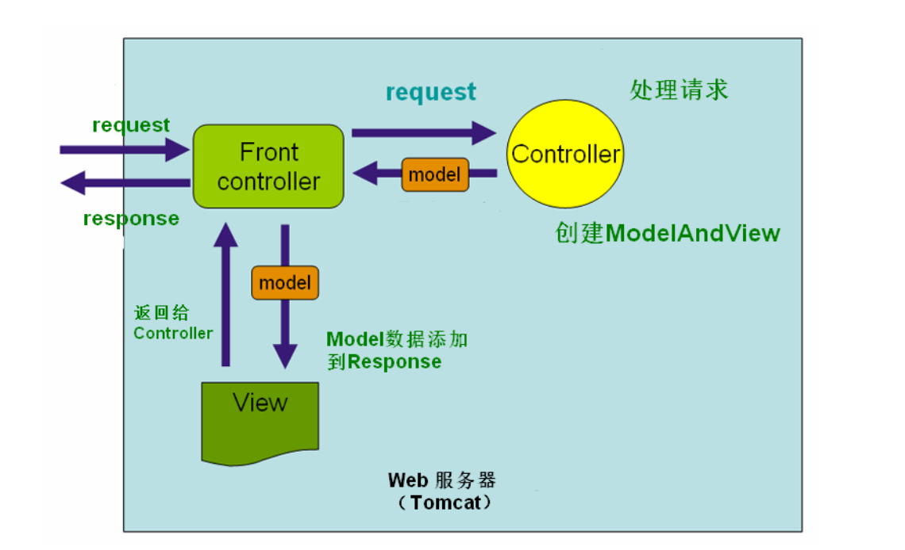
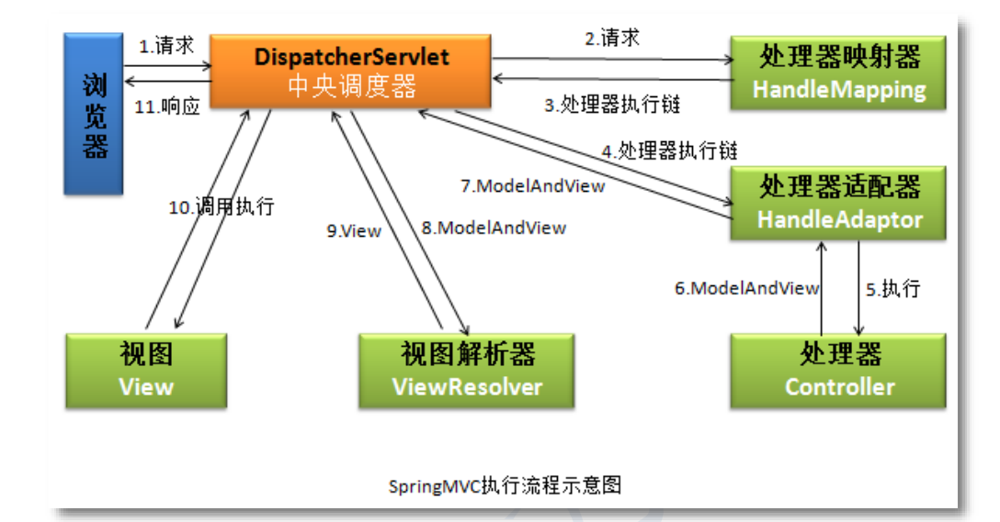

# 第一注解的 SpringMVC 项目

- ## 新建 Maven Webapp 项目

- ## 加入 Servlet、SpringMVC 依赖

```xml
<?xml version="1.0" encoding="UTF-8"?>

<project xmlns="http://maven.apache.org/POM/4.0.0" xmlns:xsi="http://www.w3.org/2001/XMLSchema-instance"
  xsi:schemaLocation="http://maven.apache.org/POM/4.0.0 http://maven.apache.org/xsd/maven-4.0.0.xsd">
  <modelVersion>4.0.0</modelVersion>

  <groupId>run.aiwan</groupId>
  <artifactId>01_HelloSpringMVC</artifactId>
  <version>1.0</version>
  <packaging>war</packaging>

  <name>01_HelloSpringMVC Maven Webapp</name>
  <!-- FIXME change it to the project's website -->
  <url>http://www.example.com</url>

  <properties>
    <project.build.sourceEncoding>UTF-8</project.build.sourceEncoding>
    <maven.compiler.source>1.8</maven.compiler.source>
    <maven.compiler.target>1.8</maven.compiler.target>
  </properties>

  <dependencies>
    <dependency>
      <groupId>junit</groupId>
      <artifactId>junit</artifactId>
      <version>4.11</version>
      <scope>test</scope>
    </dependency>
    <!--servlet依赖-->
    <dependency>
      <groupId>javax.servlet</groupId>
      <artifactId>javax.servlet-api</artifactId>
      <version>3.1.0</version>
      <scope>provided</scope>
    </dependency>
    <!--springmvc依赖-->
    <dependency>
      <groupId>org.springframework</groupId>
      <artifactId>spring-webmvc</artifactId>
      <version>5.2.5.RELEASE</version>
    </dependency>
  </dependencies>

  <build>
    <plugins>
      <!-- 编码和编译和JDK版本 -->
      <plugin>
        <artifactId>maven-compiler-plugin</artifactId>
        <version>3.1</version>
        <configuration>
          <source>1.8</source>
          <target>1.8</target>
        </configuration>
      </plugin>
    </plugins>
  </build>
</project>

```

- ## 注册中央调度器 DispatcherServlet

DispatcherServlet相当于一个前台，当有请求访问Tomcat时先调用DispatcherServlet，DispatcherServlet创建springmvc容器对象发送给相应的controller

> webapp/WEB-INF/web.xml
>
> 注意修改servlet的版本

```xml
<?xml version="1.0" encoding="UTF-8"?>
<web-app xmlns="http://xmlns.jcp.org/xml/ns/javaee"
         xmlns:xsi="http://www.w3.org/2001/XMLSchema-instance"
         xsi:schemaLocation="http://xmlns.jcp.org/xml/ns/javaee http://xmlns.jcp.org/xml/ns/javaee/web-app_4_0.xsd"
         version="4.0">

    <servlet>
        <servlet-name>springMVC</servlet-name>
        <servlet-class>org.springframework.web.servlet.DispatcherServlet</servlet-class>
        <!--springmvc配置文件位置，默认寻找/WEB-INF/springMVC-servlet.xml,springMVC为这里的servlet-name-->
        <init-param>
            <param-name>contextConfigLocation</param-name>
            <param-value>classpath:springmvc.xml</param-value>
        </init-param>
        <!--大于0的整数，tomcat创建对象的时间-->
        <load-on-startup>1</load-on-startup>
    </servlet>
    <servlet-mapping>
        <servlet-name>springMVC</servlet-name>
        <!--有两种选择 *.do,*.自定义名称 或 / -->
        <url-pattern>*.do</url-pattern>
    </servlet-mapping>
</web-app>
```

- ## SpringMVC 配置文件

> resources/springmvc.xml

```xml
<?xml version="1.0" encoding="UTF-8"?>
<beans xmlns="http://www.springframework.org/schema/beans"
       xmlns:xsi="http://www.w3.org/2001/XMLSchema-instance"
       xmlns:context="http://www.springframework.org/schema/context"
       xsi:schemaLocation="http://www.springframework.org/schema/beans http://www.springframework.org/schema/beans/spring-beans.xsd http://www.springframework.org/schema/context https://www.springframework.org/schema/context/spring-context.xsd">

    <!--声明组件扫描器，通过IOC会自动创建包下的被注解(@Controller)的对象-->
    <context:component-scan base-package="run.aiwan.controller" />

    <!--视图解析器，因为*.jsp一般放在被保护的目录/WEB-INF/*下，可以少些文件目录的名称，实质是字符串的拼接-->
    <bean class="org.springframework.web.servlet.view.InternalResourceViewResolver">
        <!--前缀-->
        <property name="prefix" value="/WEB-INF/view" />
        <!--后缀-->
        <property name="suffix" value=".jsp" />
    </bean>
</beans>
```

- ## 创建处理器即被 @Controller 的对象

> run.aiwan.controller

能处理请求的都是控制器（处理器），前面的DispatcherServlet是前端控制器，这里的MyController是后端控制器

```java
package run.aiwan.controller;

import org.springframework.stereotype.Controller;
import org.springframework.web.bind.annotation.RequestMapping;
import org.springframework.web.servlet.ModelAndView;

// 可以加value属性，默认是类名首字母小写
@Controller
public class MyController {
    // DispatcherServlet处理的请求会发送到这里，在web.xml定义的*.do
    // value的值可以有多个value = {"some.do", "other.do"}
    @RequestMapping(value = "/some.do")
    // 返回值是ModelAndView，数据处理和视图，这里将处理的数据发送的show.jsp
    public ModelAndView doSome() {
        ModelAndView mv = new ModelAndView();
        mv.addObject("msg", "Message");
        mv.addObject("fun", "function");
        // 这里简写是因为在springmvc.xml指定了文件的前后缀
        mv.setViewName("show");
        return mv;
    }
}

```

- ## 视图

> index.jsp

```jsp
<html>
<body>
<h2>Hello World!</h2>
<p><a href="some.do">some.do</a></p>
</body>
</html>

```

> /WEB-INF/view/show.jsp

```jsp
<%@ page contentType="text/html;charset=UTF-8" language="java" %>
<html>
<head>
    <title>Title</title>
</head>
<body>
<h1>msg数据:  ${msg}</h1>
<h1>fun数据:  ${fun}</h1>
</body>
</html>
```

## SpringMVC 执行的流程



