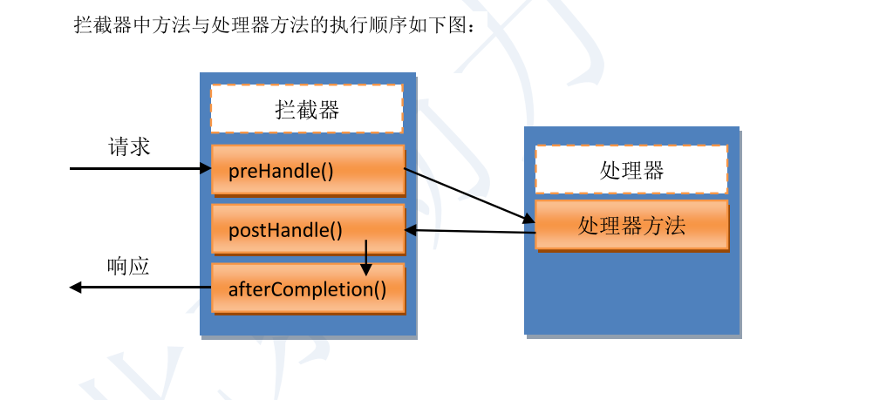
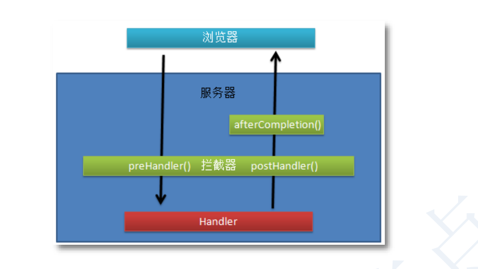

# 拦截器

SpringMVC 中的 Interceptor 拦截器是非常重要和相当有用的，它的主要作用是拦截指定的用户请求，并进行应的预处理与后处理。其拦截的时间点在“**处理器映射器根据用户提交的请求映射出了所要执行的处理器类，并且也找到了要执行该处理器类的处理器适配器， 在处理器适配器执行处理器之前**”。当然，在处理器映射器映射出所要执行的处理器类时， 已经将拦截器与处理器组合为了一个处理器执行链，并返回给了中央调度器。





```java
package run.aiwan.handler;

import org.springframework.web.servlet.HandlerInterceptor;
import org.springframework.web.servlet.ModelAndView;

import javax.servlet.http.HttpServletRequest;
import javax.servlet.http.HttpServletResponse;

public class MyInterceptor implements HandlerInterceptor {

    // preHandle 预处理方法 返回值为Boolean 判断该请求是否处理
    @Override
    public boolean preHandle(HttpServletRequest request, HttpServletResponse response, Object handler) throws Exception {
        System.out.println("预处理方法执行！！！");
        return true;
    }

    // postHandle 后处理方法 处理器方法执行后执行 可以修改处理器的返回值包括ModelAndView
    @Override
    public void postHandle(HttpServletRequest request, HttpServletResponse response, Object handler, ModelAndView modelAndView) throws Exception {
        // 这里修改了返回数据
        modelAndView.addObject("name", "bar");
        modelAndView.setViewName("show");
    }

    // afterCompletion 最后执行的方法 只要preHandle执行该方法一定执行 做资源回收
    @Override
    public void afterCompletion(HttpServletRequest request, HttpServletResponse response, Object handler, Exception ex) throws Exception {

    }
}

```

> springmvc.xml

```xml
<?xml version="1.0" encoding="UTF-8"?>
<beans xmlns="http://www.springframework.org/schema/beans"
       xmlns:xsi="http://www.w3.org/2001/XMLSchema-instance"
       xmlns:context="http://www.springframework.org/schema/context"
       xmlns:mvc="http://www.springframework.org/schema/mvc"
       xsi:schemaLocation="http://www.springframework.org/schema/beans http://www.springframework.org/schema/beans/spring-beans.xsd http://www.springframework.org/schema/context https://www.springframework.org/schema/context/spring-context.xsd http://www.springframework.org/schema/mvc https://www.springframework.org/schema/mvc/spring-mvc.xsd">

    <context:component-scan base-package="run.aiwan.controller" />

    <bean class="org.springframework.web.servlet.view.InternalResourceViewResolver">
        <property name="prefix" value="/WEB-INF/view/" />
        <property name="suffix" value=".jsp" />
    </bean>

    <!--声明拦截器，拦截器可以有0个或多个-->
    <mvc:interceptors>
        <!--声明一个拦截器-->
        <mvc:interceptor>
            <!--指定拦截的请求地址，** 表示任意字符，文件或多级目录和目录中的文件-->
            <mvc:mapping path="/**/" />
            <!--声明拦截器对象-->
            <bean class="run.aiwan.handler.MyInterceptor" />
        </mvc:interceptor>
    </mvc:interceptors>

    <mvc:annotation-driven />
</beans>
```

