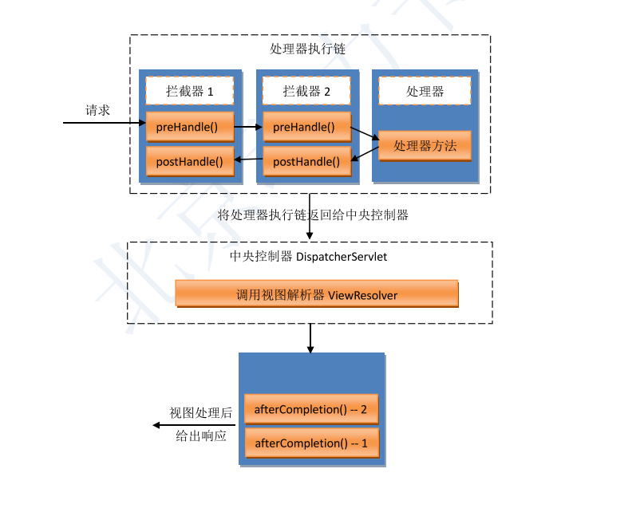

# 多个拦截器

当有多个拦截器时，形成拦截器链。拦截器链的执行顺序，与其注册顺序一致。需要再次强调一点的是，当某一个拦截器的 preHandle()方法返回 true 并被执行到时，会向一个专 门的方法栈中放入该拦截器的 afterCompletion()方法。

从图中可以看出，只要有一个 preHandle()方法返回 false，则上部的执行链将被断开，其后续的处理器方法与 postHandle()方法将无法执行。但，无论执行链执行情况怎样，只要 方法栈中有方法，即执行链中只要有preHandle()方法返回 true，就会执行方法栈中的 afterCompletion()方法。最终都会给出响应。

